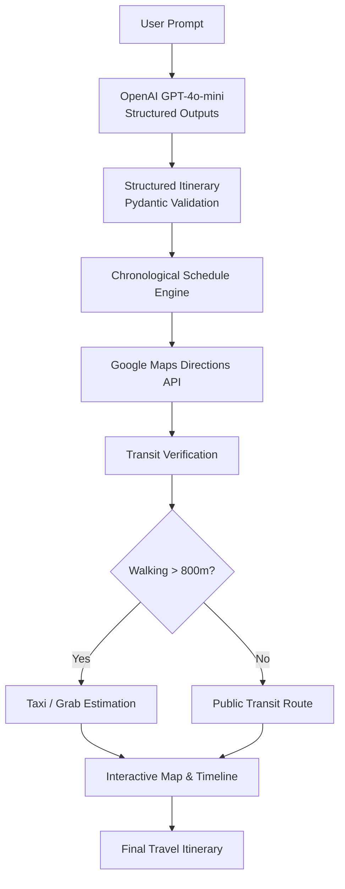

# 🇸🇬 DayOutPlanner — AI-Powered Singapore Travel Orchestrator

> An intelligent travel planning platform that combines **OpenAI GPT-4o Structured Outputs** with the **Google Maps Directions API** to generate geographically realistic, chronologically accurate itineraries across Singapore.

DayOutPlanner uses Large Language Models to curate personalized travel experiences while grounding every route with real-world navigation data. The application automatically plans attractions, calculates public transit journeys, detects excessive walking, estimates Singapore taxi fares, and visualizes the itinerary on an interactive map.

---

## ✨ Features

### 🤖 AI Itinerary Generation

Generate complete Singapore day-trip itineraries from natural language prompts using OpenAI GPT-4o Structured Outputs.

- Structured itinerary generation
- Time-aware activity planning
- Singapore-focused recommendations
- Reliable JSON responses using Pydantic

### 🚍 Real-Time Transit Routing

Uses the Google Maps Directions API to calculate real public transport routes.

Supports:

- MRT
- Public buses
- Ferries
- Walking directions

Instead of relying on LLM-estimated travel times, every journey is verified using Google Maps.

---

### 🚖 Smart Taxi / Grab Recommendation

Long walking routes reduce usability.

Whenever a walking segment exceeds **800 metres**, DayOutPlanner automatically:

- Recommends taking Taxi / Grab
- Calculates driving duration
- Estimates Singapore taxi fare ranges (SGD)

---

### ⏰ Chronological Schedule Engine

Maintains an evolving itinerary clock throughout the day.

Every route is calculated using the user's planned departure time instead of the current system time, producing chronologically consistent itineraries.

---

### 🗺️ Interactive Google Maps

Visualize the itinerary using numbered map markers.

Features include:

- Numbered attraction markers
- Interactive InfoWindows
- Automatic map centering
- Live route visualization

---

### ⚡ Bi-Directional Timeline ↔ Map Synchronization

Designed for an intuitive planning experience.

Clicking a map marker:

- Highlights the selected location
- Opens its InfoWindow
- Scrolls directly to the corresponding itinerary card

Clicking a timeline card:

- Highlights the map marker
- Centers the map on the destination

---

### 🎨 Modern Responsive Interface

Built using Next.js, TypeScript, and Tailwind CSS with a clean responsive design suitable for desktop and mobile devices.

---

# 🏗️ System Architecture



---

# ⚙️ How It Works

1. The user enters a travel request in natural language.

2. GPT-4o generates a structured itinerary using Pydantic schemas.

3. Every destination is passed to the Google Maps Directions API.

4. Google Maps calculates:

   - Transit routes
   - Walking distances
   - Driving routes
   - Travel durations

5. The scheduling engine continuously updates departure and arrival times throughout the itinerary.

6. When walking exceeds **800 metres**, the planner automatically recommends Taxi / Grab and estimates the fare.

7. The completed itinerary is displayed on an interactive map alongside a synchronized timeline.

---

# 🎯 Engineering Challenges

Large Language Models excel at generating travel recommendations but are unreliable when reasoning about transportation logistics.

Common issues include:

- Hallucinated travel durations
- Unrealistic walking distances
- Ignoring departure times
- Inefficient attraction ordering
- Invalid routing assumptions

DayOutPlanner addresses these limitations by separating **creative planning** from **route verification**.

The LLM focuses solely on itinerary generation, while Google Maps provides deterministic routing information. A chronological scheduling engine ensures that every route is calculated using the itinerary's evolving departure time instead of the current system clock.

---

# 🛠️ Technology Stack

## Frontend

| Technology | Purpose |
|------------|---------|
| Next.js (App Router) | Frontend Framework |
| TypeScript | Type Safety |
| Tailwind CSS | Styling |
| @vis.gl/react-google-maps | Interactive Maps |

---

## Backend

| Technology | Purpose |
|------------|---------|
| FastAPI | REST API |
| OpenAI GPT-4o | AI Itinerary Planning |
| Pydantic | Structured Outputs |
| Google Maps Directions API | Routing |
| googlemaps SDK | Maps Integration |
| python-dotenv | Environment Variables |
| Uvicorn | ASGI Server |

---

# 📁 Project Structure

```text
DayOutPlanner/
│
├── frontend/
│   ├── app/
│   ├── components/
│   ├── public/
│   ├── package.json
│   └── ...
│
├── backend/
│   ├── main.py
│   ├── gmaps_service.py
│   ├── helperFunction.py
│   ├── models.py
│   ├── tests/
│   ├── .env.example
│   └── requirements.txt
│
├── README.md
└── LICENSE
```

---

# 🚀 Getting Started

## Prerequisites

- Node.js 18+
- Python 3.10+
- OpenAI API Key
- Google Maps API Key

Enable the following Google services:

- Maps JavaScript API
- Directions API

---

# Backend Setup

Navigate to the backend directory.

```bash
cd backend
```

Create a virtual environment.

```bash
python -m venv venv
```

Activate the environment.

**macOS / Linux**

```bash
source venv/bin/activate
```

**Windows**

```powershell
venv\Scripts\activate
```

Install dependencies.

```bash
pip install -r requirements.txt
```

Create a `.env` file.

```env
OPENAI_API_KEY=your_openai_api_key
GOOGLE_MAPS_API_KEY=your_google_maps_api_key
```

Start the FastAPI server.

```bash
uvicorn main:app --reload --port 8000
```

Backend:

```
http://localhost:8000
```

---

# Frontend Setup

Navigate to the frontend.

```bash
cd frontend
```

Install dependencies.

```bash
npm install
```

Create `.env.local`.

```env
NEXT_PUBLIC_GOOGLE_MAPS_API_KEY=your_google_maps_api_key
```

Start the development server.

```bash
npm run dev
```

Frontend:

```
http://localhost:3000
```

---

# 📡 API

## POST `/api/plan`

Generates a complete travel itinerary.

### Request

```json
{
  "prompt": "A 1-day outdoor nature and local food tour in Singapore"
}
```

---

### Example Response

```json
{
  "title": "Singapore Nature & Food Trail",
  "summary": "Explore lush greenery followed by authentic local hawker delights.",
  "stops": [
    {
      "stop_number": 1,
      "venue_name": "Singapore Botanic Gardens",
      "start_time": "08:30",
      "end_time": "10:30",
      "duration_mins": 120,
      "why_go": "UNESCO World Heritage site with beautiful flora.",
      "lat": 1.3138,
      "lng": 103.8159,
      "transit_to_next": {
        "commute_mins": 20,
        "step_by_step": "🚇 Take MRT Circle Line..."
      }
    }
  ]
}
```

---

# 🖥️ Example Output

```text
🤖 Generating AI itinerary...

📍 Stop #1
Singapore Botanic Gardens

08:30 AM – 10:30 AM

↓

🚍 MRT + Walking

↓

📍 Stop #2
The Halia

10:35 AM – 11:35 AM

↓

🚖 Taxi Recommended

16 mins
Estimated Fare:
$14–18 SGD

↓

📍 Stop #3
MacRitchie Reservoir

01:05 PM – 02:35 PM
```

---

# 🧪 Running Tests

Using unittest:

```bash
python -m unittest discover tests
```

Using pytest:

```bash
pytest
```

---

# 🚀 Future Enhancements

- Multi-day itinerary generation
- Weather-aware scheduling
- Attraction opening-hour validation
- Budget-aware trip planning
- Restaurant reservation integration
- Hotel-aware optimization
- Google Calendar export
- PDF itinerary generation
- User preference learning
- Route caching for faster responses

---

# 📄 License

Distributed under the MIT License.

---

# 👨‍💻 Author

**Sherlock Y**

- GitHub: https://github.com/Sherlock-YH
- Portfolio: https://www.sherlock-YH.top

---

> Built to demonstrate how Large Language Models can be combined with deterministic mapping and routing services to create practical, real-world travel planning applications.
