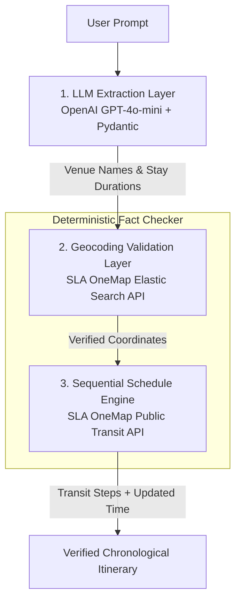

# 🇸🇬 DayOut SG — AI Singapore Itinerary Planner

> An intelligent, context-aware itinerary generator that orchestrates OpenAI LLM capabilities with official **SLA OneMap APIs** to produce chronologically verified, geographically logical day plans across Singapore.


---

## 🎯 The Engineering Problem

Large Language Models (LLMs) are great creative planners, but they lack spatial awareness and reliable coordinate knowledge. Left unguided, LLMs frequently:

- **Hallucinate travel times** (e.g., claiming a 2 km walk takes 5 minutes in tropical weather).
- **Invent invalid coordinates** that fall in neighboring countries or bodies of water, triggering API runtime failures.
- **Ignore schedule dynamics** (e.g., calculating transit using the system execution time rather than the user's planned departure time).

**DayOut SG** solves this by using the LLM solely as a **Creative Planner**, while enforcing a **Deterministic Fact-Checking Pipeline** backed by official Singapore Land Authority (SLA) public transit and geocoding services.

---

## 🏗️ System Architecture



---

## ✨ Key Features

- **Strict Type-Safety Contracts** using OpenAI Structured Outputs (`client.beta.chat.completions.parse`) with Pydantic v2, eliminating manual JSON parsing.
- **Geocoding Validation Layer** that intercepts LLM-generated venue names and verifies them through SLA OneMap Elastic Search before routing.
- **Dynamic Chronological Scheduling** that maintains a running itinerary clock and queries transit APIs using the user's planned departure time rather than system time.
- **Turn-by-Turn Route Verification** replacing hallucinated travel estimates with official bus routes, MRT lines, transfers, and walking distances.

---

## 📂 Project Structure

```text
dayOutPlanner/
├── main.py              # Pipeline orchestration
├── poc.py               # OpenAI Structured Output & Pydantic schemas
├── onemap.py            # SLA OneMap authentication, search & routing
├── .env.example         # Environment variable template
├── requirements.txt     # Python dependencies
└── README.md
```

---

## 🛠 Tech Stack

- **Language:** Python 3.10+
- **AI Infrastructure:** OpenAI GPT-4o-mini with Structured Outputs
- **Validation:** Pydantic v2
- **GIS & Routing:** SLA OneMap APIs
- **Environment Management:** python-dotenv

---

## 🚀 Getting Started

### Prerequisites

- Python 3.10+
- An OpenAI API key
- A free SLA OneMap Developer account

### 1. Clone the Repository

```bash
git clone https://github.com/yourusername/dayOutPlanner.git
cd dayOutPlanner
```

### 2. Create a Virtual Environment

macOS / Linux

```bash
python3 -m venv venv
source venv/bin/activate
```

Windows

```powershell
python -m venv venv
venv\Scripts\activate
```

### 3. Install Dependencies

```bash
pip install -r requirements.txt
```

or

```bash
pip install openai pydantic requests python-dotenv
```

### 4. Configure Environment Variables

Create a `.env` file in the project root.

```env
OPENAI_API_KEY=sk-proj-your-openai-key
ONEMAP_EMAIL=your_onemap_email@example.com
ONEMAP_PASSWORD=your_onemap_password
```

---

## ▶️ Run the Application

```bash
python main.py
```

---

## 🛡️ System Reliability & Edge Cases

| Edge Case | Typical LLM Behavior | DayOut SG Solution |
|-----------|----------------------|--------------------|
| **Coordinate Hallucination** | Generates coordinates outside Singapore (e.g., latitude `1.798`), causing routing failures. | Validates every venue through SLA OneMap Elastic Search and replaces hallucinated coordinates with official values. |
| **Schedule Misalignment** | Uses current system time when querying transit APIs, producing incorrect routes for future itineraries. | Maintains a sequential itinerary clock and queries OneMap using the user's planned departure time. |
| **Excessive Walking Routes** | Suggests 2 km+ walks between attractions. | Limits walking distance (`maxWalkDistance = 500 m`) and automatically requests multimodal bus/MRT routes instead. |

---

## 📖 How It Works

1. The user submits a natural-language itinerary request.
2. GPT-4o-mini extracts structured venues and activity durations using Pydantic schemas.
3. Every venue is validated through the SLA OneMap Elastic Search API.
4. Verified coordinates are passed to the SLA OneMap Public Transit API.
5. A sequential itinerary clock updates departure times after every activity.
6. The final itinerary contains verified locations, realistic transit times, and chronological scheduling.

---

## 📜 License

This project is licensed under the MIT License.
