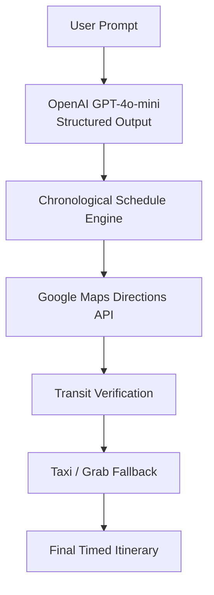

# 🇸🇬 DayOutPlanner — AI-Powered Singapore Travel Orchestrator

> An intelligent itinerary planning engine that combines **OpenAI GPT-4o Structured Outputs** with the **Google Maps Directions API** to generate geographically realistic, chronologically accurate travel plans across Singapore.


---

# 📖 Overview

Large Language Models are excellent at recommending places to visit but struggle with real-world travel logistics. They frequently underestimate travel times, recommend impractical walking routes, or generate itineraries that are not chronologically feasible.

**DayOutPlanner** solves this problem by combining an LLM's planning capability with deterministic routing powered by the Google Maps Directions API.

The planner generates a structured itinerary, calculates exact public transport routes between every destination, maintains an evolving schedule throughout the day, and automatically recommends Taxi/Grab alternatives whenever walking becomes unreasonable.

The result is a travel plan that is both creative and practically executable.

---

# ✨ Features

- 🤖 **AI Itinerary Generation**
  - Uses OpenAI GPT-4o Structured Outputs to generate consistent travel plans.

- 🗺️ **Google Maps Route Verification**
  - Every destination is routed using the Google Maps Directions API instead of relying on LLM-estimated travel times.

- 🚆 **Public Transport Planning**
  - Supports MRT, buses, ferries and walking routes.

- ⏰ **Chronological Schedule Engine**
  - Maintains arrival and departure times across the entire itinerary.

- 🚖 **Taxi / Grab Recommendation**
  - Detects excessive walking (>800m) and estimates taxi fares and driving durations automatically.

- 📍 **Singapore-Specific Prompt Engineering**
  - Encourages realistic venue names, hawker centres, park entrances, and geographically clustered itineraries.

- ✅ **Structured Outputs**
  - Eliminates JSON parsing errors using OpenAI Structured Outputs with Pydantic.

---

# 🏗 System Architecture



---

# ⚙️ How It Works

1. The user submits a natural-language travel request.

2. GPT-4o-mini generates a structured itinerary using Pydantic schemas.

3. Every destination is routed through the Google Maps Directions API.

4. The planner calculates:

   - Public transport routes
   - Walking distances
   - Travel durations
   - Arrival times
   - Departure times

5. If a walking segment exceeds **800 metres**, the planner:

   - Calculates driving duration
   - Estimates Singapore taxi fares
   - Recommends Taxi/Grab as an alternative

6. The final itinerary is returned as a chronologically consistent travel schedule.

---

# 🎯 Engineering Challenges

Large Language Models excel at generating activity recommendations but are unreliable when reasoning about transportation logistics.

Common problems include:

- Hallucinated travel durations
- Unrealistic walking distances
- Ignoring departure times
- Inefficient route ordering
- Inconsistent schedule calculations

DayOutPlanner addresses these limitations by separating **creative planning** from **route verification**.

The LLM is responsible for suggesting attractions and activities, while Google Maps provides deterministic routing information. A scheduling engine continuously updates the itinerary clock so every subsequent route is calculated using the correct planned departure time rather than the current system time.

---

# 📁 Repository Structure

```text
DayOutPlanner/
│
├── main.py
│   Core execution pipeline
│
├── gmaps_service.py
│   Google Maps integration
│   - Transit routing
│   - Driving directions
│   - Taxi fare estimation
│
├── helperFunction.py
│   Utility functions
│   - Fare calculations
│   - Time formatting
│   - Output helpers
│
├── tests/
│   └── test_helperFunction.py
│
├── .env.example
│
├── .gitignore
│
├── requirements.txt
│
└── README.md
```

---

# 🛠 Technology Stack

| Component | Technology |
|-----------|------------|
| Programming Language | Python 3.10+ |
| AI Model | OpenAI GPT-4o-mini |
| Structured Outputs | Pydantic v2 |
| Mapping & Routing | Google Maps Directions API |
| Environment Variables | python-dotenv |
| Testing | unittest / pytest |

---

# 🚀 Getting Started

## Prerequisites

- Python 3.10+
- OpenAI API Key
- Google Maps API Key with **Directions API** enabled

---

## 1. Clone the Repository

```bash
git clone https://github.com/Sherlock-YH/DayOutPlanner.git

cd DayOutPlanner
```

---

## 2. Create a Virtual Environment

### macOS / Linux

```bash
python3 -m venv .venv

source .venv/bin/activate
```

### Windows

```powershell
python -m venv .venv

.venv\Scripts\activate
```

---

## 3. Install Dependencies

```bash
pip install -r requirements.txt
```

---

## 4. Configure Environment Variables

Copy the example environment file.

```bash
cp .env.example .env
```

Edit `.env`:

```env
OPENAI_API_KEY=sk-proj-your-openai-api-key
GOOGLE_MAPS_API_KEY=your-google-maps-api-key
```

---

# ▶️ Running the Application

Run the planner:

```bash
python main.py
```

---

# 🖥 Example Output

```text
🤖 Generating itinerary...

📍 Stop #1
Singapore Botanic Gardens

09:00 AM – 10:30 AM

↓

🚍 Public Transit
Walk 123 m

↓

📍 Stop #2
The Halia

10:32 AM – 11:32 AM

↓

🚖 Taxi Recommended

16 mins
Estimated Fare:
$14–18 SGD

↓

📍 Stop #3
MacRitchie Reservoir
```

---

# 🧪 Running Tests

Using Python's unittest:

```bash
python -m unittest discover tests
```

Using pytest:

```bash
pytest
```

---

# 🔮 Future Improvements

- Interactive web interface
- Multi-day itinerary generation
- Budget-aware trip planning
- Weather-aware scheduling
- Attraction opening-hour validation
- Restaurant reservation integration
- Hotel-aware route optimisation
- User preference learning
- Export itinerary to Google Calendar
- PDF itinerary generation

---

# 📄 License

This project is licensed under the MIT License.

---

# 👤 Author

**Sherlock Y**

- GitHub: https://github.com/Sherlock-YH
- Portfolio: https://www.sherlock-YH.top

---

> Built to demonstrate practical applications of Large Language Models by combining AI planning with deterministic mapping and routing services for reliable real-world itinerary generation.
